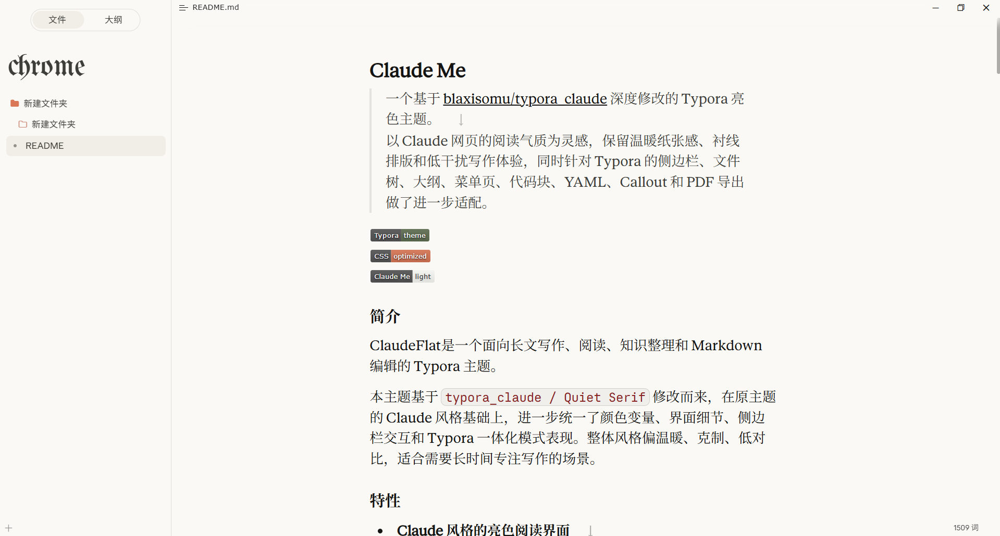
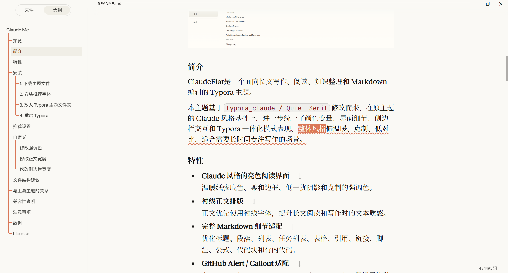
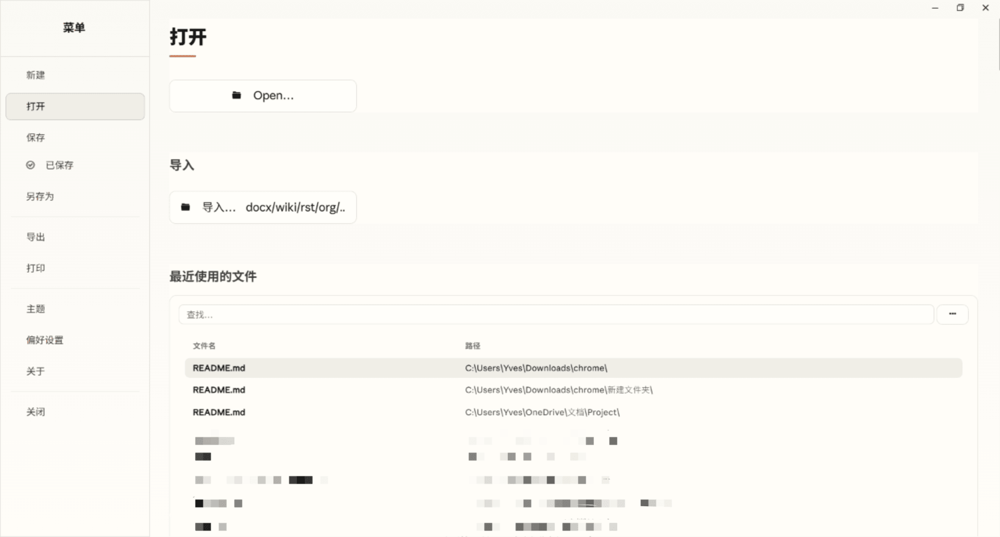
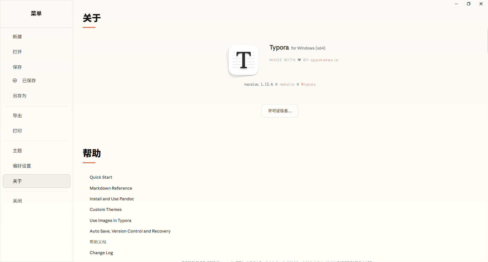

# ClaudeFlat

> 一个基于 [blaxisomu/typora_claude](https://github.com/blaxisomu/typora_claude) 深度修改的 Typora 亮色主题。  
> 以 Claude 网页的阅读气质为灵感，保留温暖纸张感、衬线排版和低干扰写作体验，同时针对 Typora 的侧边栏、文件树、大纲、菜单页、代码块、YAML、Callout 和 PDF 导出做了进一步适配。


## 预览



---



------



---



## 简介

ClaudeFlat是一个面向长文写作、阅读、知识整理和 Markdown 编辑的 Typora 主题。

本主题基于 `typora_claude / Quiet Serif` 修改而来，在原主题的 Claude 风格基础上，进一步统一了颜色变量、界面细节、侧边栏交互和 Typora 一体化模式表现。整体风格偏温暖、克制、低对比，适合需要长时间专注写作的场景。

## 特性

- **Claude 风格的亮色阅读界面**  
  温暖纸张底色、柔和边框、低干扰阴影和克制的强调色。

- **衬线正文排版**  
  正文优先使用衬线字体，提升长文阅读和写作时的文本质感。

- **完整 Markdown 细节适配**  
  优化标题、段落、列表、任务列表、表格、引用、链接、脚注、公式、代码块和行内代码。

- **GitHub Alert / Callout 适配**  
  对 Note、Tip、Important、Warning、Caution 等提示块做了统一的视觉设计。

- **YAML 元信息块美化**  
  为 Typora 的 YAML Front Matter 添加纸张质感、标签和轻量装饰。

- **侧边栏与文件树重绘**  
  优化文件列表、文件树、搜索框、大纲、选中态、悬停态、图标、缩进和超长文件名显示。

- **一体化模式适配**  
  针对 Typora 的一体化窗口、顶部栏、菜单页、最近文件、表单和按钮做了统一风格处理。

- **右键菜单与浮层优化**  
  调整菜单圆角、阴影、动效、悬停状态和视觉层级。

- **PDF / 打印适配**  
  针对导出 PDF 和打印时的边距、标题、表格、代码块等细节进行优化。

- **更统一的 CSS 结构**  
  使用集中变量管理颜色、字体、圆角、阴影和尺寸，方便后续二次修改。

## 安装

### 1. 下载主题文件

```text
ClaudeFlat.css
```

这样在 Typora 的主题列表中会显示为更简洁的主题名。

### 2. 安装推荐字体

本主题默认优先使用以下字体族：

```css
--font-serif: "Anthropic Serif Web Text", Georgia, "Times New Roman", "Noto Serif SC", serif;
--font-sans: "Anthropic Sans Web Text", "Noto Sans SC", system-ui, "Segoe UI", Roboto, Helvetica, Arial, sans-serif;
--font-mono: "Anthropic Mono Variable", ui-monospace, monospace;
```

推荐安装：

- Anthropic Serif Web Text
- Anthropic Sans Web Text
- Anthropic Mono Variable
- Noto Serif SC / 思源宋体
- Noto Sans SC / 思源黑体

### 3. 放入 Typora 主题文件夹

在 Typora 中打开：

```text
偏好设置 → 外观 → 打开主题文件夹
```

将 CSS 文件复制到该文件夹中。

### 4. 重启 Typora

重启 Typora 后，在主题列表中选择：

```text
ClaudeFlat
```

或与你 CSS 文件名对应的主题名称。

## 推荐设置

为了获得更接近设计目标的体验，建议：

- 外观模式：使用 **一体化模式**
- 缩放比例：可尝试 **120%**
- 代码块：建议关闭代码块行号
- Markdown 操作：高亮、下划线、粗体、斜体等建议先选中文字再使用快捷键
- 水平滚动：如表格或代码较宽，可使用 `Shift + 鼠标滚轮`

## 自定义

主题的大部分颜色、字体和尺寸都集中在 `:root` 变量中。你可以优先修改这些变量，而不是直接改大量选择器。

常用变量：

```css
:root {
  --bg-color: #faf9f5;
  --hover-color: #f0eee6;
  --font-color: #141413;
  --accent-color: #d97757;
  --accent-color-dark: #a94f2d;

  --font-serif: "Anthropic Serif Web Text", Georgia, "Times New Roman", "Noto Serif SC", serif;
  --font-sans: "Anthropic Sans Web Text", "Noto Sans SC", system-ui, "Segoe UI", Roboto, Helvetica, Arial, sans-serif;
  --font-mono: "Anthropic Mono Variable", ui-monospace, monospace;

  --sidebar-width: 280px;
  --radius-8: 8px;
  --radius-12: 12px;
  --radius-20: 20px;
}
```

### 修改强调色

```css
:root {
  --accent-color: #d97757;
  --accent-color-dark: #a94f2d;
  --accent-color-soft: #d9775733;
  --accent-color-border: #d9775740;
}
```

### 修改正文宽度

```css
#write {
  max-width: 752px;
}
```

### 修改侧边栏宽度

```css
:root {
  --sidebar-width: 280px;
}
```

## 与上游主题的关系

本主题基于 [blaxisomu/typora_claude](https://github.com/blaxisomu/typora_claude) 修改。

上游主题提供了 Claude 风格 Typora 主题的主要设计基础，包括 Claude 风格的 Markdown 排版、衬线阅读体验、侧边栏适配和字体资源。本项目在此基础上进一步整理、优化和扩展。

主要改动包括：

- 统一 CSS 变量命名和兼容别名
- 优化亮色主题的颜色、边框、阴影和焦点状态
- 调整 Typora 侧边栏、文件树、大纲和搜索细节
- 增强一体化模式、菜单页、右键菜单和浮层的一致性
- 优化 YAML、Callout、代码块、表格、脚注和 PDF 导出表现
- 清理重复规则，统一格式和注释结构

## 兼容性说明

该主题主要针对 Typora 桌面端设计。

已重点适配：

- Windows 版 Typora
- Typora 一体化模式
- 文件树视图
- 大纲视图
- PDF / 打印导出

macOS 下大部分样式可用，但部分窗口栏、侧边栏或系统控件细节可能与 Windows 表现不同。

## 注意事项

由于主题为了保持简洁和低干扰，会隐藏或弱化部分 Typora 默认界面元素，例如：

- 收展侧边栏按钮
- 切换源码模式按钮
- 部分 Markdown 标记符号
- 部分水平滚动条
- 部分默认边框和分割线

如果你依赖这些控件，可以在 CSS 中搜索对应注释或选择器，将相关 `display: none` / `background: transparent` 等规则删除或覆盖。

## 致谢

感谢 [blaxisomu/typora_claude](https://github.com/blaxisomu/typora_claude) 提供的原始主题设计与实现基础。

## License

本项目是基于上游主题的个人修改版。发布前请根据你的实际仓库内容、字体来源、截图素材和上游项目要求补充许可证说明。

如果你继续分发基于上游主题的版本，建议保留来源声明和致谢。
